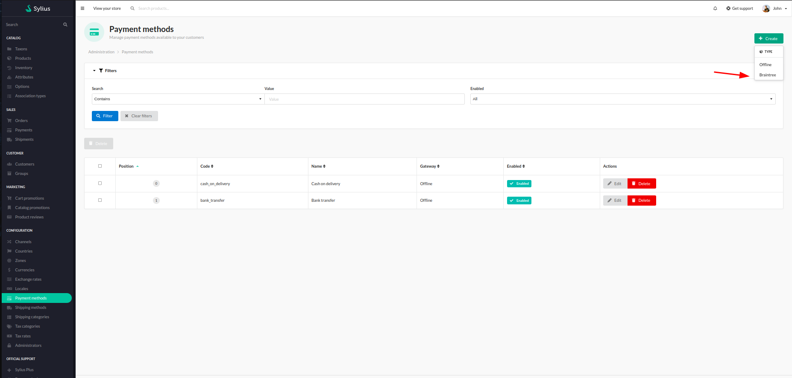
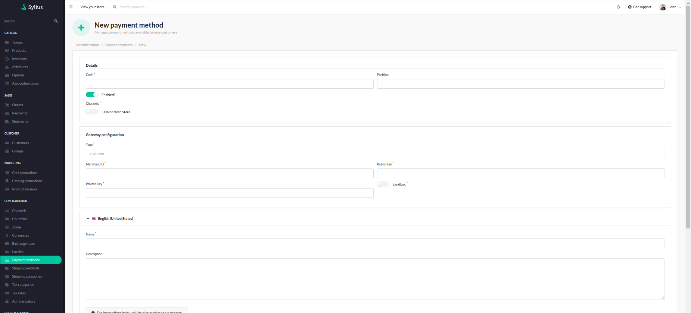

# Functionalities

---

The plugin integrates Braintree payments with Sylius based applications.

After an installation, user should be able to create new Braintree payment method in the "Payment methods" section in the admin panel.

    

Once there, user can fill out the configuartion form with all the needed info like configuration keys, id, type of the environment, code, name etc..

    

After this, created payment method should be visible in the checkout.
